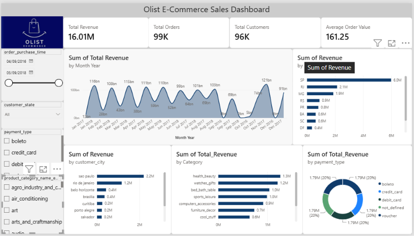
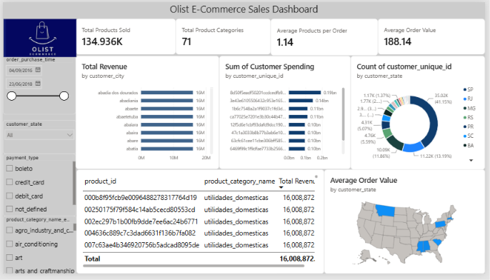
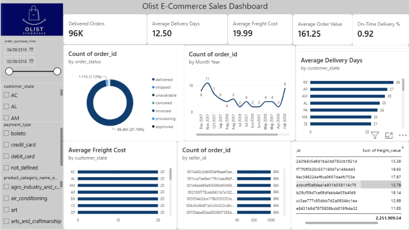
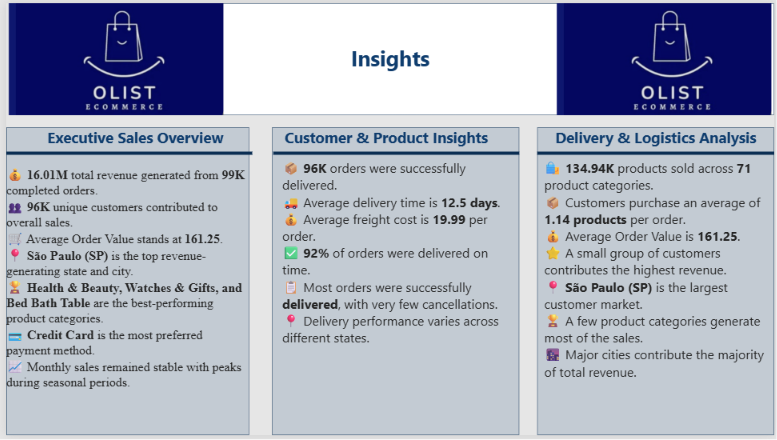

## 📌  Project Overview **Olist Brazilian E-Commerce Dataset** 

This project analyzes the **Olist Brazilian E-Commerce Dataset** using **MySQL** for data cleaning, transformation, and business analysis, while **Power BI** is used to build interactive dashboards.

The project provides insights into sales performance, customer behavior, product performance, and delivery logistics through three professional dashboards.

---

# 🛠️ Tools & Technologies

- 🗄️ MySQL
- 📊 Power BI
- 📝 SQL
- ⚡ DAX
- 🔄 Power Query

---

# 📊 Dashboard 1 – Executive Sales Overview



### Highlights
- 💰 Total Revenue: **16.01M**
- 📦 Total Orders: **99K**
- 👥 Total Customers: **96K**
- 🛒 Average Order Value: **161.25**
- 📍 São Paulo generated the highest revenue.
- 💳 Credit Card is the most preferred payment method.

---

# 👥 Dashboard 2 – Customer & Product Insights



### Highlights
- 🛍️ **134.94K** products sold.
- 📦 **71** product categories.
- 🛒 Average **1.14** products per order.
- ⭐ Top customers contributed the highest revenue.
- 📍 São Paulo has the largest customer base.

---

# 🚚 Dashboard 3 – Delivery & Logistics Analysis



### Highlights
- 📦 **96K** orders delivered.
- 🚚 Average delivery time: **12.5 Days**
- 💰 Average freight cost: **19.99**
- ✅ **92%** On-Time Delivery Rate.
- 🏪 Top sellers handled the majority of orders.

---

# 💡 Business Insights



---

# 📈 Key Features

- Executive Sales Dashboard
- Customer & Product Analysis
- Delivery & Logistics Dashboard
- Interactive KPI Cards
- Dynamic Slicers & Filters
- Business Insights
- Professional Dashboard Design

---

# 🗄️ SQL Analysis

The SQL folder contains:

- Database Creation
- Table Creation
- Data Import Scripts
- Foreign Keys
- Business Queries

---

# 📂 Dataset

**Olist Brazilian E-Commerce Public Dataset**

https://www.kaggle.com/datasets/olistbr/brazilian-ecommerce

---

# 📥 Power BI Dashboard

The PBIX file exceeds GitHub's upload limit.

**Download PBIX Here**

👉 https://drive.google.com/file/d/1BUSPZQdUNUJaKhNNyiZsBFzA-0fC-qrf/view?usp=drive_link

---

# 📂 Repository Structure

```text
Olist-Ecommerce-Sales-Analysis/
│
├── README.md
├── SQL/
│   ├── 01_Create_Tables.sql
│   ├── 02_Data_Import.sql
│   ├── 03_Foreign_Keys.sql
│   └── 04_Business_Queries.sql
│
├── PowerBI/
│
├── Images/
│   ├── 01_Executive_Dashboard.png
│   ├── 02_Customer_Product_Dashboard.png
│   ├── 03_Delivery_Logistics_Dashboard.png
│   └── Dashboard_Insights.png
│
└── Dataset/
    └── dataset_link.txt
```

---

# 👨‍💻 Author

**Sameer Humane**

If you found this project helpful, please ⭐ star this repository.
